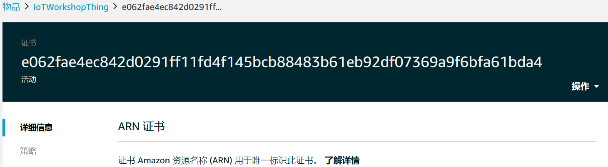

# Lab 1: 设备注册
## 1. 登录AWS IoT控制台
输入***账户***、***用户名***和***密码***进入AWS管理控制台。 
  
在服务中找到物联网系列服务，点击***AWS IoT***，打开AWS IoT管理控制台。 
  
  
 
## 2. 注册设备
在左侧菜单栏选择***管理-物品***，点击右上角的***创建***按钮，打开创建AWS IoT物品界面。 
  
  
 
在这里我们选择***创建单个物品***按钮。创建单个物品共有三个步骤： 
**第一步**，***将设备添加到物品注册表*** 
* 赋予所添加物品一个***名称***，比如IoTWorkshopThing
* 为物品选择或者创建***类型*** (可选)
* 将物品添加到***物品组*** (可选)
* 设置可搜索的物品***属性*** (可选)
* 配置完成点击***下一步***
  
  
**第二步**，***添加物品的证书*** 
这里采用一键式创建证书方式，点击***创建证书***按钮。 
  
  
几秒钟之后，会弹出***证书已创建***界面，生成设备连接所需要的三个证书，包括：该物品的证书，公有密钥和私有密钥。点击***下载***，将证书保存到本地磁盘当中，以备后面的步骤使用。 
此外，连接设备还需要AWS IoT的根CA证书，点击下载打开下载页面，这里建议下载RSA 2048 位密钥：Amazon Root CA 1， 将该证书同样保存到本地磁盘当中，以备后面的步骤使用。 
点击***激活***按钮，使证书生效。 
该步骤完成后，可以点击完成按钮，完成物品的注册，也可以点击***附加策略***按钮，进行物品策略的配置。 
**第三步**，***添加物品的策略*** （可选） 
为创建的物品选择策略，可选择多个策略，在选择是可通过查看选项，查看策略内容。 
选择完成后，点击***注册物品***按钮，完成物品注册。 
  
物品成功注册后，后显示在物品列表当中。 
  
## 3. 新建策略
策略是在AWS IoT当中用于设置物品访问权限。在左侧的菜单栏中选择***安全-策略***，点击右上角的创建按钮，打开策略配置界面。
  
 
策略创建中填写如下信息： 
* 为策略赋予一个***名称***，比如IoTWorkShopPolicy
* 为策略添加声明，包括：
[tab]* 设置***操作***为iot:*，为可执行所有的IoT相关操作
[tab]* 设置***资源ARN***为*，可用于所有IoT资源
[tab]* 设置***效果***为允许
上述操作为针对所有IoT资源可以执行所有IoT操作。 
设置完成后，点击右下角***创建***按钮。 
  
  
策略创建完成后，可在策略列表看到刚创建的策略。 
## 4. 为设备添加策略
策略创建完成需要将其与设备进行绑定，策略的绑定是与与设备相关的证书进行的。 
首先查看刚注册的设备所绑定的证书的名称。在物品列表中选择刚定义设备，在物品页面左侧的菜单列表中选择***安全性***，打开物品的证书列表。点击证书查看证书信息。 
  
   
在右上角操作菜单中，选择***附加策略***菜单。 
   
在打开的策略列表中选择一个或多个策略附加给当前证书，即可与设备进行关联。 
   
至此，一个设备就被注册到了AWS IoT Core的环境当中。 

