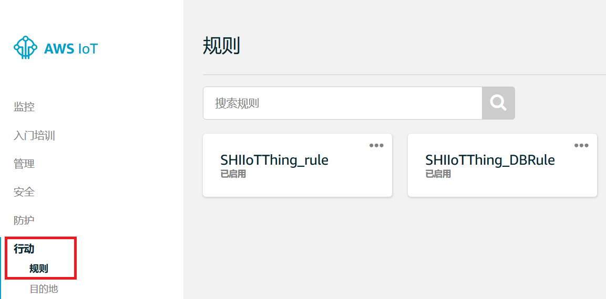
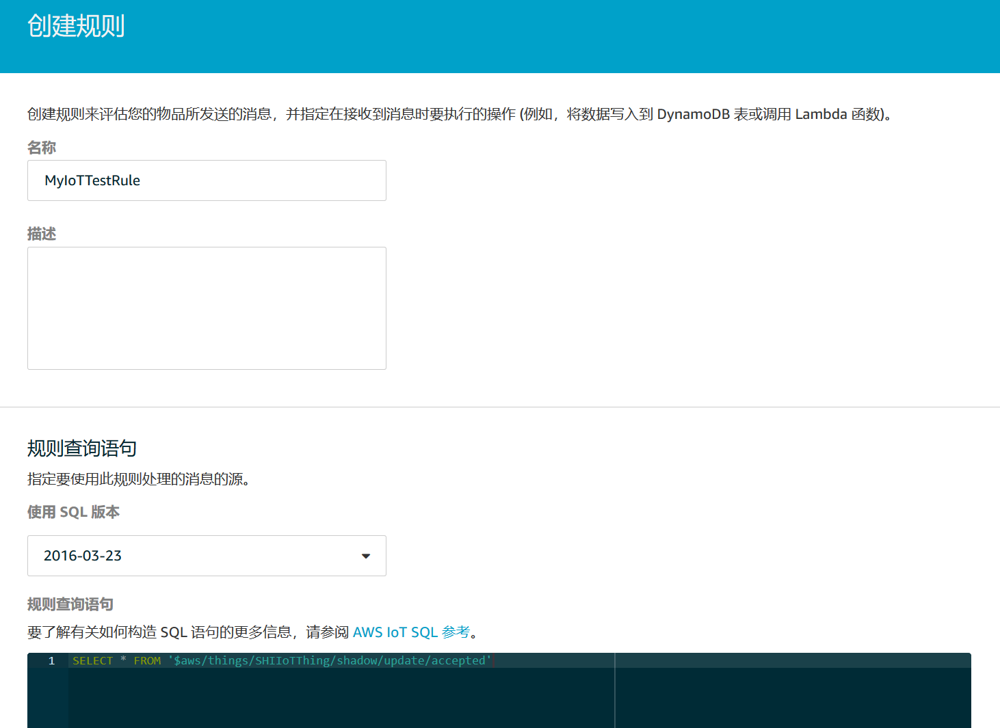
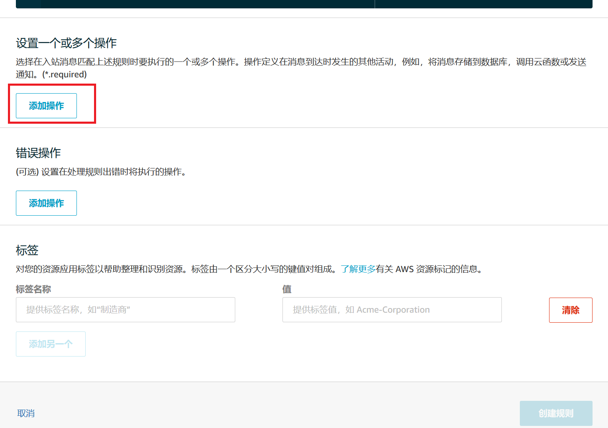
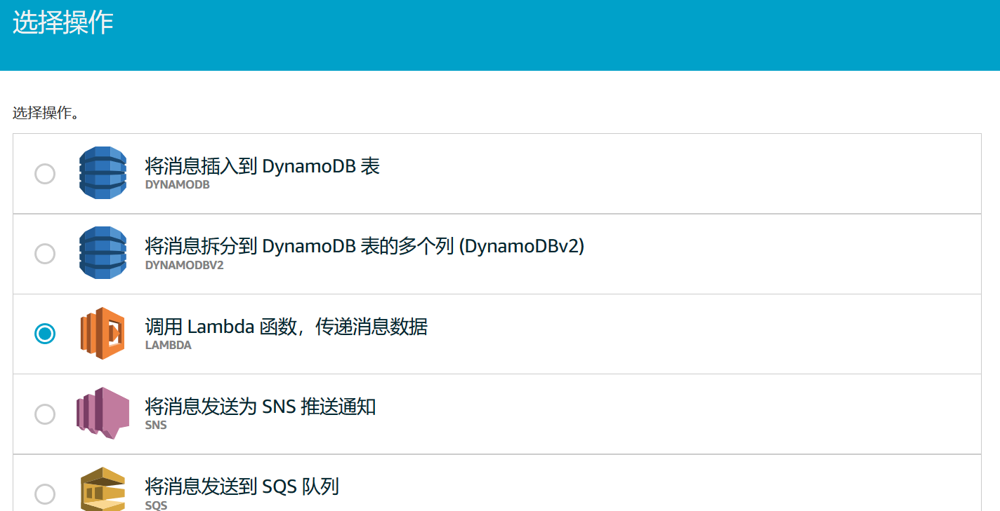
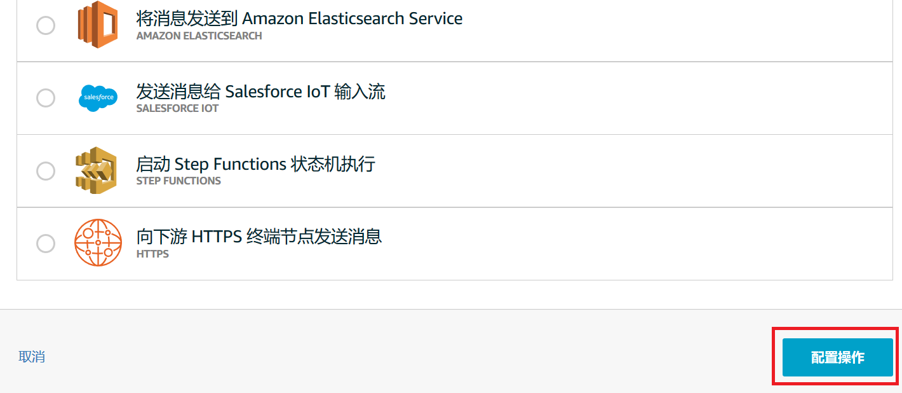
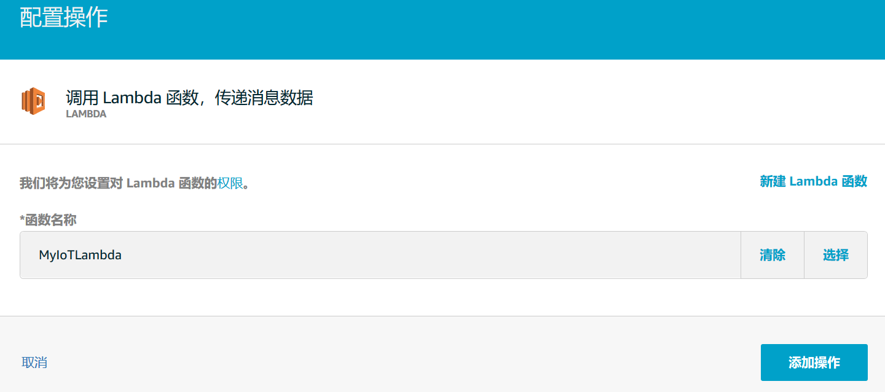
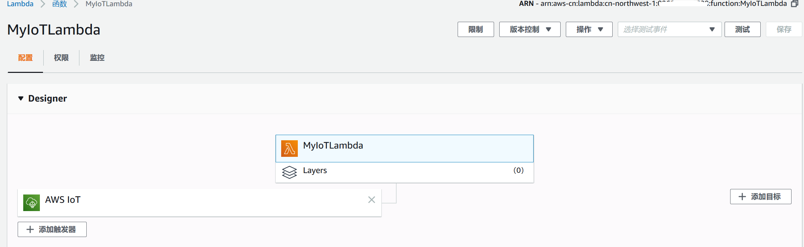
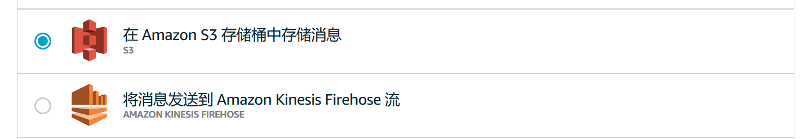
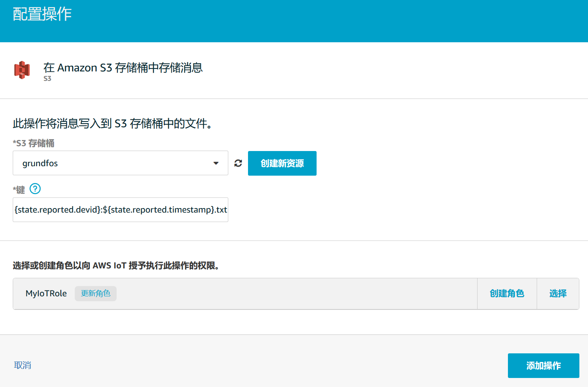

# Lab3: 数据存储与数据处理
物联网数据采集之后，所面临第一个问题就是如何存储这些数据，再一个就是怎样使用这些数据。AWS IoT Core提供了非常便利的手段帮助用户对数据进行存储和处理。在本文所介绍的应用场景中，我们主要通过AWS IoT Core所提供的规则(Rule)与操作(Action)来触发数据存储和处理操作。 
AWS IoT Core规则由 SQL SELECT 语句、主题筛选条件和规则操作组成。设备通过将消息发布到 MQTT 主题来向 AWS IoT Core发送信息。利用 SQL SELECT 语句，您可以从传入的 MQTT 消息提取数据。AWS IoT Core规则的主题筛选条件用于指定一个或多个 MQTT 主题。当主题收到与主题筛选条件匹配的 MQTT 消息时，将触发规则。借助规则操作，您可以获取从 MQTT 消息提取的信息并将其发送到其他 AWS 服务。 
AWS IoT Core规则操作用于指定规则触发后应执行的操作。用户可以定义一些操作以便将数据写入 Amazon DynamoDB 数据库或 Amazon Kinesis 流，或者调用 Lambda 函数等。 
在该业务场景中，我们使用AWS IoT Core规则触发两个操作，我们直接对AWS IoT Core所接收到的所有温度监测数据进行处理。 

## 1. 创建规则
登录到AWS控制台之后，进入到AWS IoT Core控制台，在左侧的菜单列表中选择***行动-规则***，打开***规则***界面。 

 

点击界面中的***创建***按钮，进行规则的创建。创建规则需要设置如下信息： 
规则***名称***，输入该规则的名字。
设置***规则查询语句***，使用类似SQL的语句，从AWS IoT Core的MQTT Topic当中提取数据，也是规则的触发条件，这里我们所设置的查询语句如下：
> SELECT * FROM '$aws/things/SHIIoTThing/shadow/update/accepted'  
> 这是设备影子的一个MQTT Topic，是指从设备发送到影子之后，被成功接收的数据，该语句是从该Topic上提取所有的消息数据，也就是说每次接收到一条设备消息，都会触发这个规则。 

 

规则的查询语句设置完成之后，我们需要为规则添加操作，即规则被触发之后，需要执行的操作。 

## 2. 添加操作
在规则设置界面中，找到***设置一个或多个操作***，点击***添加操作***按钮。 

 

AWS IoT Core的规则支持多种操作，在接下来的操作中，我们选择其中的两种: AWS Lambda和Amazon S3。 

### 设置AWS Lambda操作
这里设置一个AWS Lambda函数操作，将设备发送到AWS IoT Core的数据传递给Lambda函数，由这个函数将数据报文解析后，写入到MySQL数据库表当中。该函数的创建步骤参见[这里](https://github.com/steelren/aws_iot_core_workshop/blob/master/ref2.db.lambda.function.md)。 
在打开的操作列表中，选择***调用Lambda函数，传递消息数据***。 

 

 

点击***配置操作***按钮。 
在打开的配置操作界面中，选择之前配置好的Lambda函数，点击***添加操作***按钮，完成AWS Lambda函数操作的添加。 

 

添加完成后，我们可以到AWS Lambda函数页面，能够看到，函数增加了一个AWS IoT的触发器。

 

### 设置Amazon S3操作
这里设置一个Amazon S3操作，将设备发送到AWS IoT Core的数据以文件方式保存到S3的桶中。在打开的操作列表中，选择***在Amazon S3存储桶中存储消息***，并开始进行配置。 

 

在打开的配置界面中，配置如下信息: 
选择或者创建***S3存储桶***，这个桶是设备消息在Amazon S3中存储的位置。 
设置S3存储桶中的恶***键***，Amazon S3中的数据是以键值对方式存储的，可以简单的理解为这个键就是存储在桶的文件的名字。这里我们可以设置如下键: 
> ${state.reported.devid}:${state.reported.timestamp}.txt 
> 表示使用报文中的设备ID和数据的时间戳作为文件的名称。 

 

配置完成后，点击***添加操作***按钮，完成Amazon S3操作的添加。 
这种消息的保存方式是每一条消息在S3的桶中保存一个文件，一般在生产环境中使用的比较少，更多的会使用AWS IoT Core的规则调用Amazon Kinesis，再将其存入S3。 

至此，一个比较简单的配置处理和存储设备物联网数据的AWS IoT Core规则就配置完成了。当设备再将消息发送上来之后，我们就可以看一下，MySQL数据库表和S3桶中，是否已经保存好了数据和文件。 

