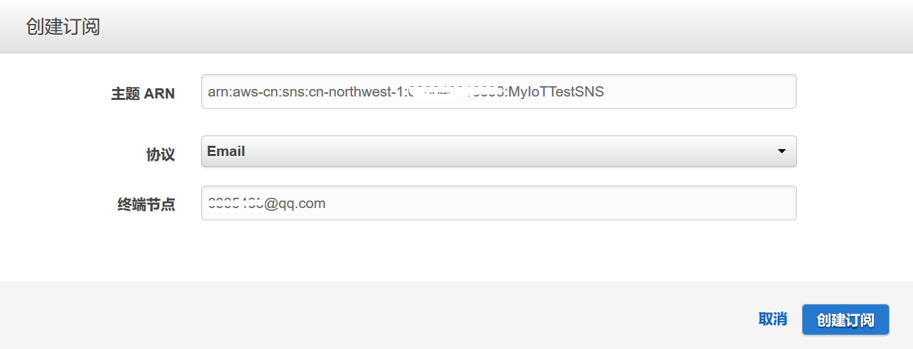

# Lab 4: 邮件告警
在物联网业务中，大量的数据从设备和传感器一端产生，这些数据能够直接的反应出设备或者设备相关的业务所运行的状态。在实际的生产环境中，根据设备运行状态数据，通过一些特定的规则来判断设备异常，并触发相应的处理事件，是非常常见的一种业务场景。比如设备温度过高触发告警，就是非常典型的应用场景。在本业务场景中，我们也利用AWS IoT Core的规则来实现超温触发邮件告警的功能。 

## 1. 创建AWS SNS消息服务
登录进入AWS控制台，在移动服务当中，选择***SNS***服务，打开SNS控制面板，点击***创建主题***。 

 

在打开的***创建新主题***界面设置***主题名称***和***显示名称***。 

 

在***主题详细信息***页面，点击***创建订阅***按钮。 

 

在***创建订阅***页面，设置***协议***和***终端节点***，这里我们使用email协议，并填入告警邮件所发送的邮箱。 

 

回到***主题详细信息***页面，选择刚创建的订阅，点击***请求订阅***按钮。 

 

会有一封确认邮件发送到邮箱当中，点击右键中的***Confirm Subscription***链接，进行确认。 

 

确认成功后，订阅列表中会显示用户信息。 

 

这样一个接受告警信息，并发送告警邮件的的SNS服务配置完成。 

## 2. 配置告警规则
在AWS IoT控制台界面当中，我们参考Lab 3的步骤，创建用于触发邮件告警的规则。规则需要设置如下信息： 
规则***名称***，输入该规则的名字。 
设置***规则查询语句***，这里我们所设置的查询语句如下： 
> SELECT * FROM '$aws/things/SHIIoTThing/shadow/update/accepted' WHERE state.reported.temperature >= 40   
> 该查询语句说明每次接收到一条设备消息，当消息中温度字段的值大于40，才会触发这个规则。 

 

然后为规则添加操作，这里我们要添加***将消息发送为SNS推送通知***操作。 

 

在SNS推送通知中设置如下的信息: 
选择***SNS目标***，选择配置好的SNS主题。 
设置***消息格式***，这里设置为***RAW格式***，为原始格式。 
选择或者创建一个向AWS IoT授权进行SNS操作的角色。 

 

点击***添加操作***按钮，返回规则界面，点击***创建规则***按钮，完成规则的创建。 

我们可以试试将LM35靠近一杯热水或者其他温度高的东西，当有超过40度的数据发出后，我们可以看看邮箱里面是否接收到了告警邮件。
