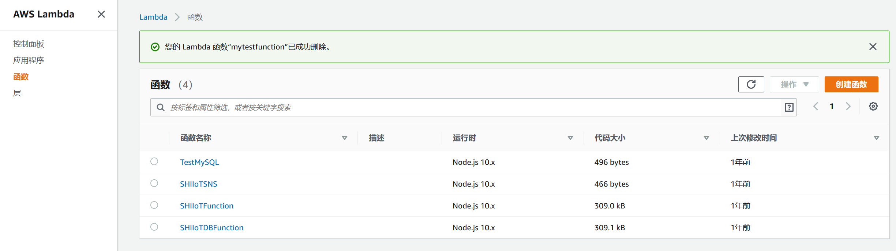
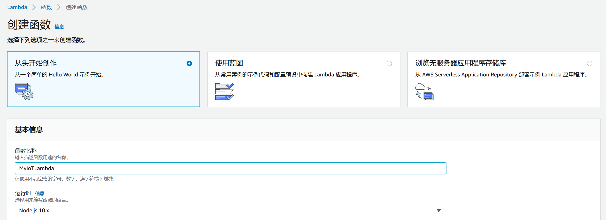
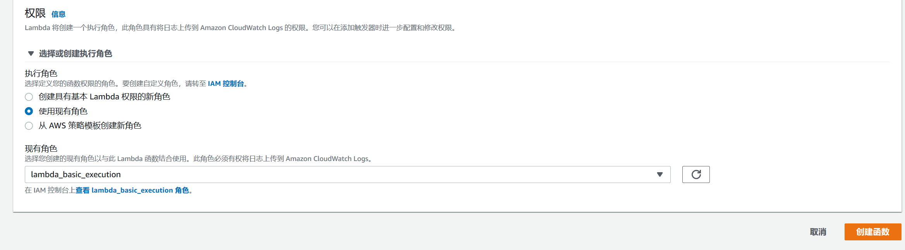
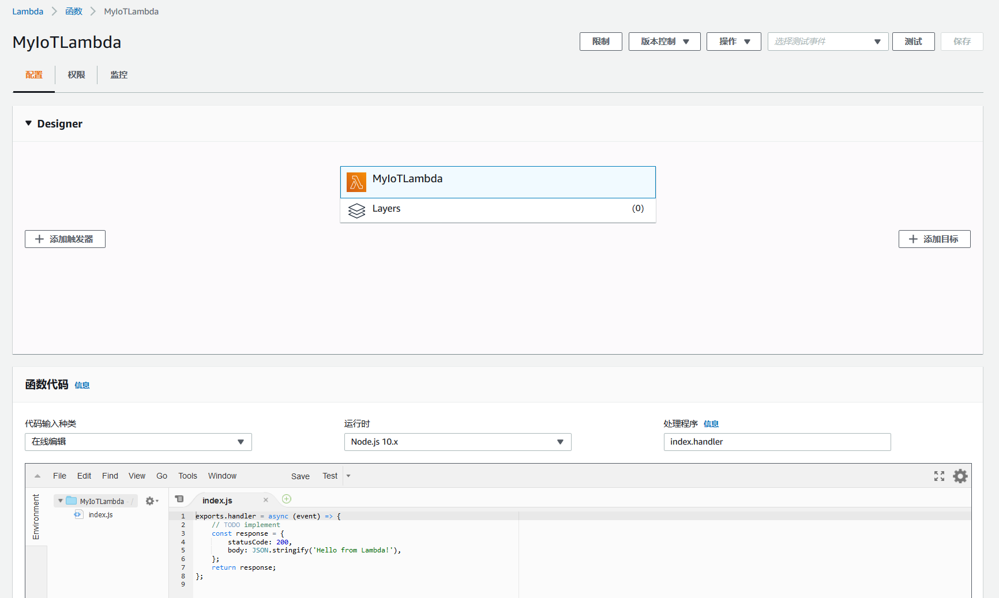
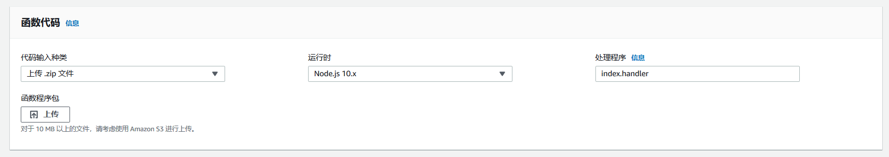
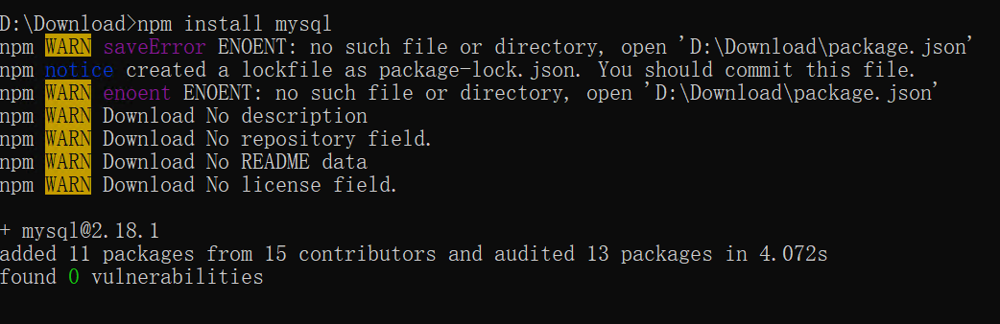
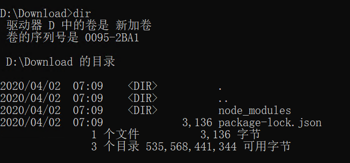
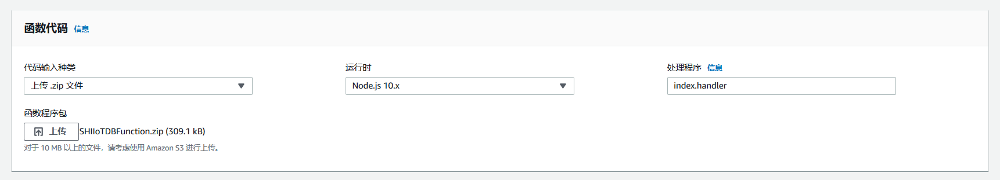
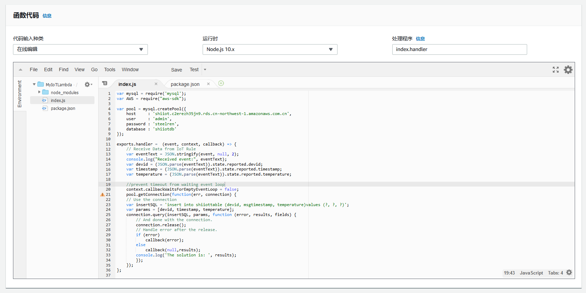
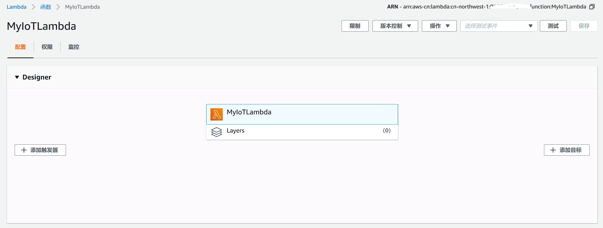

# 创建IoT报文处理函数
本节内容我们创建一个AWS Lambda函数用来接收AWS IoT Core的规则转发的物联网报文,并将报文解析后,写入到MySQL数据库的库表当中。<br>

## 1. 创建AWS Lambda函数
登录AWS控制台，选择Lambda服务，进入Lambda控制台界面。选择***函数***菜单，打开函数列表，点击***创建函数***按钮，创建一个新的Lambda函数。<br>
<p align="center"> 

</p>

在打开的***创建函数***界面当中，需要配置如下信息：<br>
选择***从头开始创作***<br>
设置***函数名称***，为Lambda函数设置一个名字<br>
设置***运行时***，这里我选择Node.js 10.x，通过Node.js代码来进行数据的处理<br>
设置***执行角色***，该角色为执行Lambda函数的角色，用户也可以选择创建新的。这里我们选择***使用已有角色***，在下拉列表中选择lambda_basic_execution。
<p align="center"> 

</p>
<p align="center"> 

</p>

设置完成之后，点击***创建函数***进行Lambda函数的创建，这样我们就创建了一个机遇Node.js 10.x的空Lambda函数。
<p align="center"> 

</p>

## 2. 编写代码
通过打开的Lambda函数编辑界面，我们可以直接编写也可以通过导入的方式，将写好的代码导入到Lambda环境当中。因为在这个场景中，我们需要使用Node.js代码操作MySQL数据库，所以我们需要将MySQL相关的Node.js环境打入到代码中，所以需要在外部打包，将代码导入到Lambda当中。<br>
<p align="center"> 

</p>

首先，我们创建一个带有MySQL环境的Node.js包。<br>
在安装了Node.js环境的主机当中，在命令行界面运行如下命令：
> nmp install mysql

<p align="center"> 

</p>

该命令会下载MySQL相关的Node.js运行时文件，在当前目录下生成一个node_modules目录和一个package文件。
<p align="center"> 

</p>

因为在我们之前创建空Lambda函数中，***处理程序***是***index.handler***，所以这里我们在当前目录下创建一个index.js，该函数的内容如下：
```C
// 引入MySQL运行环境和AWS SDK
var mysql = require('mysql');
var AWS = require("aws-sdk");

// MySQL数据库连接池
var pool = mysql.createPool({
	host     : 'shiiot.******.rds.cn-northwest-1.amazonaws.com.cn',
	user     : 'admin',
	password : '******',
	database : 'shiiotdb'
});

exports.handler =  (event, context, callback) => {
	// 从IoT规则接收数据
	var eventText = JSON.stringify(event, null, 2);
  console.log("Received event:", eventText);
  // 解析出JSON报文中的数据
  var devid = (JSON.parse(eventText)).state.reported.devid;
  var timestamp = (JSON.parse(eventText)).state.reported.timestamp;
  var temperature = (JSON.parse(eventText)).state.reported.temperature;
	
	//prevent timeout from waiting event loop
	context.callbackWaitsForEmptyEventLoop = false;
  // 连接数据库
	pool.getConnection(function(err, connection) {
	// 使用Insert语句将数据插入数据库表
	var insertSQL = 'insert into shiiottable (devid, msgtimestamp, temperature)values (?, ?, ?)';
	var params = [devid, timestamp, temperature];
	connection.query(insertSQL, params, function (error, results, fields) {
		// And done with the connection.
		connection.release();
		// Handle error after the release.
		if (error) 
			callback(error);
		else
			callback(null,results);
		console.log('The solution is: ', results);
		});
	});
};

```

将node_modules目录，package.json文件和index.js文件打包为一个ZIP文件。使用AWS Lambda的上传功能进行上传。
<p align="center"> 

</p>

上传之后就可以看到导入的环境文件和代码。
<p align="center"> 

</p>

点击***保存***按钮，保存AWS Lambda函数。
<p align="center"> 

</p>

这样，一个处理IoT报文，并且将数据保存到MySQL数据库表的AWS Lambda函数，创建完成。

